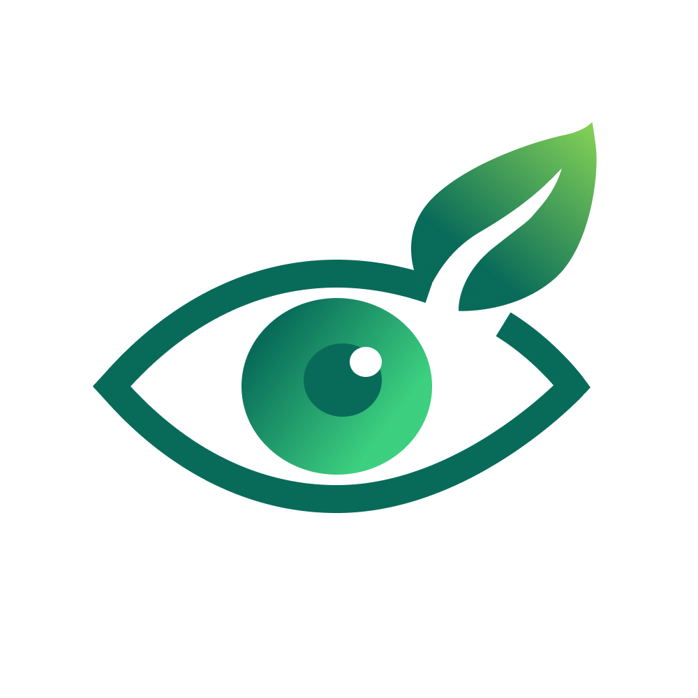
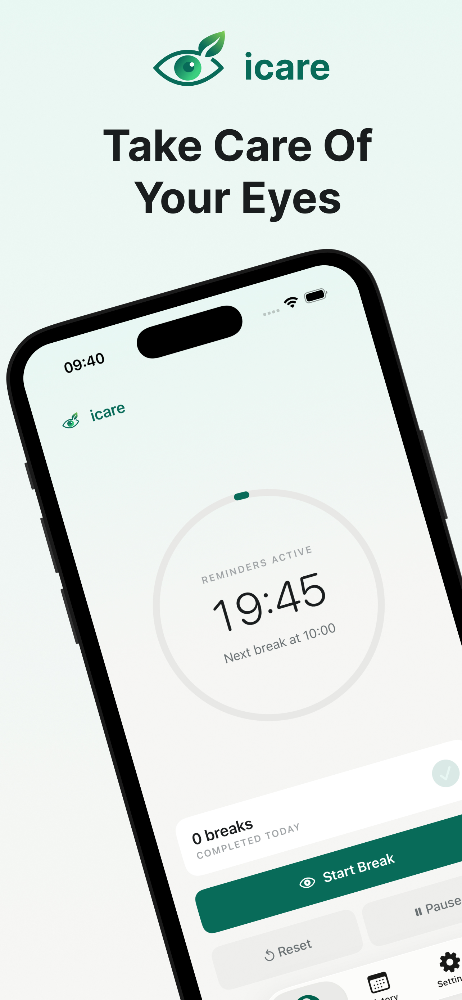
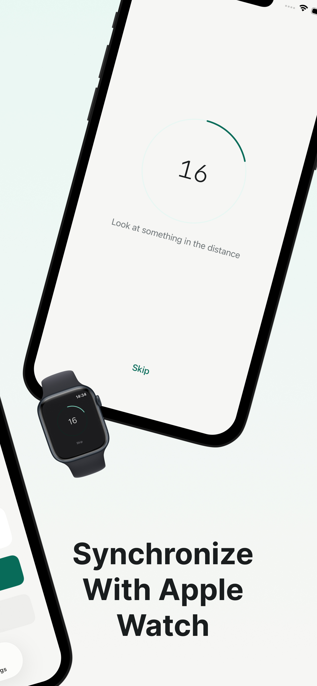
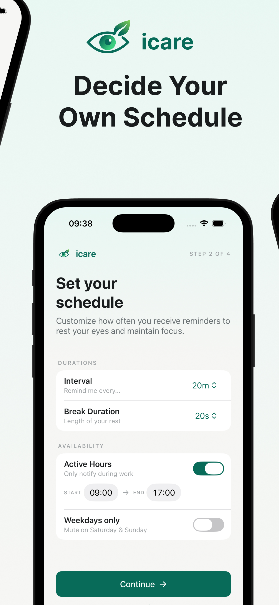
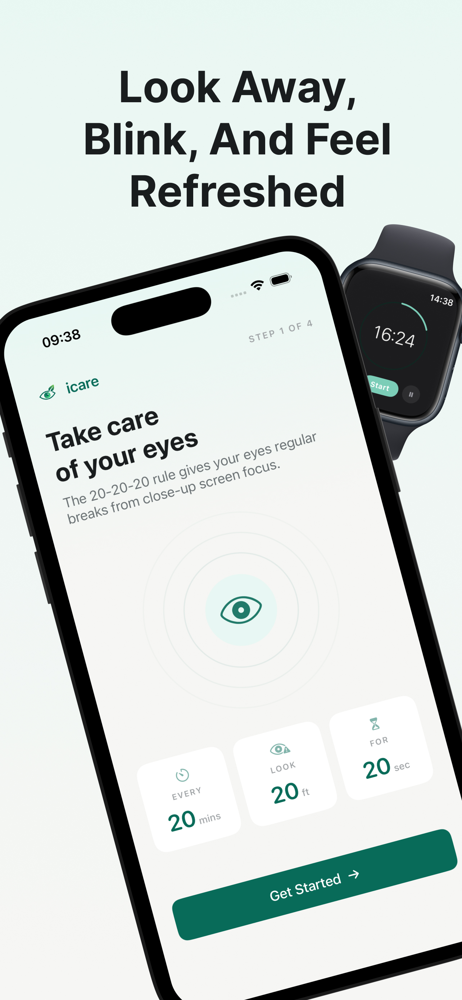
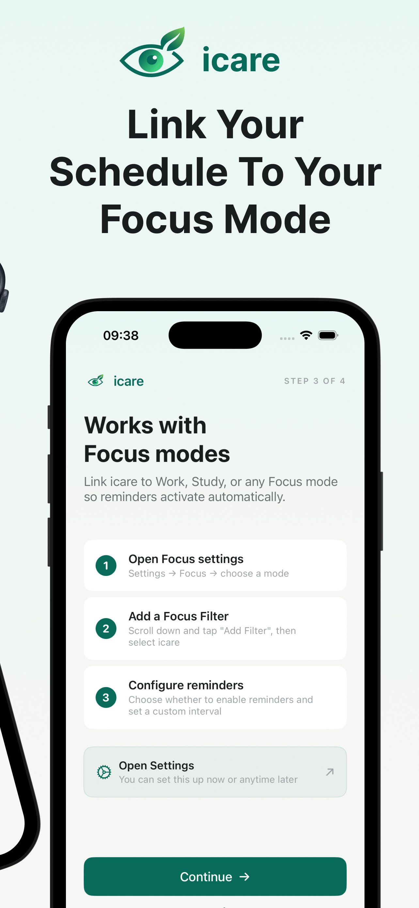

<p align="center">
  
</p>

<h1 align="center">iCare</h1>

<p align="center">
  A free, minimal 20-20-20 eye-break reminder for iPhone and Apple Watch.
</p>

<p align="center">
  
  
  
</p>

---

iCare helps you follow the [20-20-20 rule](https://www.aao.org/eye-health/tips-prevention/computer-usage): every 20 minutes, look at something 20 feet away for 20 seconds. It sends quiet reminders on a schedule you control, and a single tap starts a short countdown so you can get back to work.

The app is fully usable on iPhone alone and meaningfully better with Apple Watch, where reminders arrive as subtle haptic taps on your wrist.

## Screenshots

<p align="center">
  
  
  
  
  
</p>

## Features

- **Recurring local reminders** on a configurable interval (15 -- 45 minutes)
- **One-tap countdown** to complete a break from a notification or the app
- **Apple Watch companion** with haptic reminders, on-wrist countdown, and WatchConnectivity sync
- **Focus filter integration** to override reminder behavior per Focus mode
- **Configurable schedule** -- active hours, weekdays-only, break duration (10 -- 30 s)
- **Pause, snooze, skip** -- stay in control without turning reminders off
- **Today's history** -- see completed and skipped breaks at a glance
- **No accounts, no backend, no subscriptions** -- data stays on your device

## Project Structure

```
iCare/                 iPhone app (SwiftUI)
  App/                 Entry point and root navigation
  Features/            Home, Countdown, History, Settings, Onboarding
  Intents/             Focus filter (SetFocusFilterIntent)

iCareWatch/            watchOS app
  App/                 Entry point
  Features/            Home, Countdown, Notification scene

Shared/                Code shared between iPhone and Watch
  Models/              AppState, settings, break records
  Services/            ReminderEngine, NotificationCoordinator, WatchSyncManager, etc.
  DesignSystem/        Colors, typography, shared UI components
  Assets.xcassets/     App icons and images

docs/                  Product briefs, specs, architecture, and delivery plans
fastlane/              Fastlane config for signing and releases
.github/workflows/     Tag-based CI/CD deploy pipeline
```

## Requirements

| Tool | Version |
|------|---------|
| Xcode | 16+ |
| iOS deployment target | 17.0 |
| watchOS deployment target | 10.0 |
| Ruby (for Fastlane) | 3.2+ |
| [XcodeGen](https://github.com/yonaskolb/XcodeGen) | latest |

## Getting Started

```bash
# 1. Clone the repo
git clone https://github.com/<your-org>/iCare.git
cd iCare

# 2. Generate the Xcode project
xcodegen generate

# 3. Open in Xcode
open iCare.xcodeproj

# 4. Select the "iCare" scheme, pick a simulator, and run
```

No third-party Swift packages are required -- the app uses Apple frameworks only.

### Fastlane (optional)

Fastlane is used for CI releases. To set it up locally:

```bash
bundle install
bundle exec fastlane sync_certs   # requires Match repo and ASC credentials
bundle exec fastlane release       # builds, signs, and uploads to App Store Connect
```

See `fastlane/Fastfile` for details.

## Architecture

iCare is a pure SwiftUI app with no external dependencies. Key design decisions:

- **`AppState`** is the central observable model shared across views. It owns reminder scheduling, break state, notification handling, and Watch sync.
- **`ReminderEngine`** manages the scheduling cadence -- intervals, active hours, weekday filtering, pause/resume, and snooze.
- **`NotificationCoordinator`** handles all `UserNotifications` interactions including actionable notification categories (Start / Snooze / Skip).
- **`WatchSyncManager`** bridges iPhone and Watch state via `WatchConnectivity`, syncing settings and relaying commands in both directions.
- **`SettingsStore`** persists user preferences in `UserDefaults` with an App Group (`group.com.iCare.shared`) so both targets can access shared state.
- **Focus filter** is implemented as an `SetFocusFilterIntent` (App Intents framework), allowing users to customize reminder behavior per Focus mode.

For the full technical design, see [`docs/technical/architecture.md`](docs/technical/architecture.md).

## Documentation

The `docs/` directory contains detailed product and technical documentation:

- [Product brief](docs/product/product_brief.md) -- problem, positioning, and principles
- [MVP spec](docs/product/mvp_spec.md) -- requirements, scope, and non-goals
- [User flows](docs/product/user_flows.md) -- core journeys on iPhone and Watch
- [Architecture](docs/technical/architecture.md) -- modules, notification strategy, platform design
- [Data model](docs/technical/data_model.md) -- app state and storage
- [Notification strategy](docs/technical/notification_strategy.md) -- scheduling rules and failure modes
- [Implementation plan](docs/delivery/implementation_plan.md) -- milestone-based build order
- [Acceptance criteria](docs/delivery/acceptance_criteria.md) -- release gates and QA scenarios

## Contributing

Contributions are welcome! If you'd like to help:

1. Fork the repository
2. Create a feature branch (`git checkout -b my-feature`)
3. Make your changes and verify they build on both iPhone and Watch simulators
4. Open a pull request with a clear description of what you changed and why

Please keep changes focused -- iCare intentionally avoids feature bloat. See the [MVP spec](docs/product/mvp_spec.md) for the project's scope philosophy.

## License

This project is licensed under the [MIT License](LICENSE).
